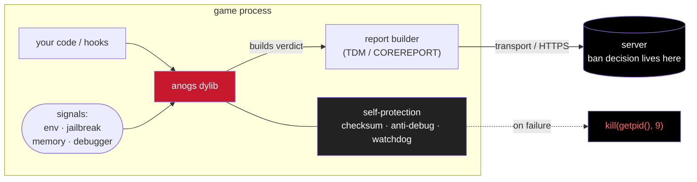
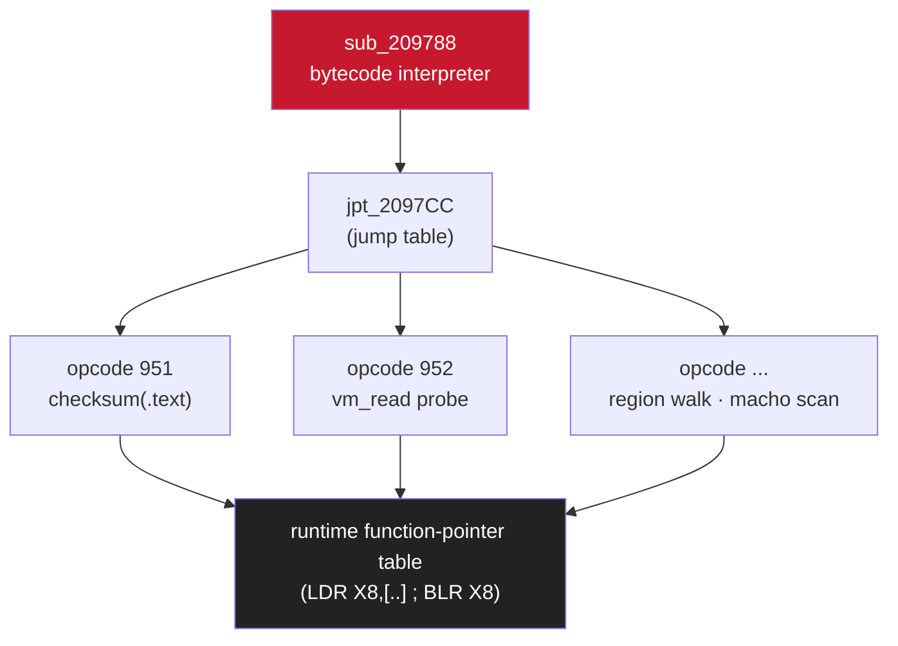
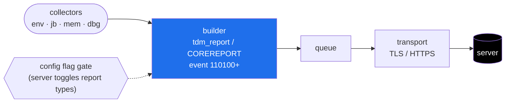

# tencent-ace-anogs-notes

<p align="center">
  
  
  
  
  
</p>

Reverse-engineering notes on Tencent's ACE anti-cheat — the `anogs` / **AnoSDK**
component, "TSS" internally — on iOS (arm64). How it's built, and why the obvious
ways people try to neutralize it get them **banned** or **crash the app** instead.

This is analysis, not a bypass cookbook. The naive patch is the wrong move; this
writeup explains what the thing actually does, and deliberately stops at *how it
works and why the easy attacks fail*.

> **Who this is for.** You maintain an app that ships ACE and you're debugging false
> positives or crashes, or you're a researcher mapping mobile anti-cheat.

---

## Architecture at a glance



| Layer | Contents |
|-------|----------|
| **Exports** | `AnoSDKInit` / `AnoSDKInitEx`, `AnoSDKSetUserInfo`, `AnoSDKOnRecvData`, `AnoSDKGetReportData[2/3/4]`, `AnoSDKIoctl` / `AnoSDKIoctlOld` |
| **TDM / REPORT plugin** | Builds the tamper reports |
| **Self-protection** | `.text` integrity checksum, anti-debug, self-kill watchdog |
| **Transport** | Ships reports off-device (its own HTTPS, or the game's channel) |

It talks to a separate SDK (GCloudCore-style) that owns the actual HTTP, and it
integrates with the game's own networking too.

> **Reports are the product.** anogs collects device and environment signals,
> decides if something's off, and sends a verdict up. Bans are almost always
> **server-side** off those reports, not a local decision.

---

## How to read it

Standard iOS RE applies, with three anogs-specific wrinkles.

### 1. Strings are XOR-obfuscated

Event names, probed path lists, detection labels — all encrypted. Break the table
before the code makes sense. The decoder is a per-entry XOR with a rolling key and a
checksum byte:

```c
// enc = encrypted table, i = entry offset
uint8_t v   = enc[i];
uint8_t len = enc[i + 1] ^ enc[i];
for (int j = 0; j < len; j++) {
    out[j] = enc[i + 2 + j] ^ v;
    v = ((v + j) ^ 0x52) + 2;          // rolling key (constants vary per range)
}
// keep only entries where:  (enc[i] ^ enc[i+2+len]) == ~(0xFF ^ xor(out))
```

The log/format strings around the C++ scaffolding are often **plaintext**
(`"init_info->size_:%d"`, `"...send_data_to_svr:%p"`) — they hand you struct layouts
and the important handoff points for free.

### 2. It hides its libc/objc calls behind a resolver

Instead of calling `send` or `open` through the normal stub, anogs resolves function
pointers through an internal hashed lookup table and calls them indirectly:

```asm
; not this:            ; but this:
bl   _send             ldr   x8, [x9, #off]   ; hashed-table slot
                       blr   x8               ; indirect -> real target
```

So a naive xref on `send` won't show anogs' own use, and inline-hooking a stub may
not catch it. Determine whether the resolver hands back the **real target** or the
**GOT slot** — that decides whether GOT-rebinding even reaches its calls.

### 3. Control flow is flattened, and detection runs in a VM

The watchdog and init paths are CFG-obfuscated (state-machine dispatch with magic
constants); Hex-Rays there is close to useless — read raw asm, follow the calls and
the terminal behavior.

The detection primitives themselves are driven by a **bytecode VM**: a jump-table
interpreter with a few thousand handlers, running scripts pushed from the server.



Because handlers dispatch through a runtime pointer table, you can't enumerate them
by static xref, and what a given build actually checks isn't fully visible offline.

---

## The report pipeline



The builder is gated by a server config flag, and the wire body is serialized and
usually TLS-encrypted by the time it leaves. Two consequences trip everyone up:

1. By the time the report hits a raw socket `send`, it's already **TLS ciphertext**
   — byte-matching the plaintext event name on the socket sees nothing.
2. The report may leave over the SDK's own HTTPS client, over the game's transport,
   or via a callback the game registered — depending on how the host initialized it.
   `AnoSDKInitEx` may pass a **null sender**, meaning anogs sends it itself. There's
   also a **pull model**: the game calls `AnoSDKGetReportData` and ships the blob
   over its own channel.

---

## The three traps that make "just patch it" fail

This is the part to internalize.

### Trap 1 — it checksums its own `__text`

anogs hashes its own code pages. Write a single byte into its `.text` — an inline
hook, a `MOV X0,#0; RET` on a report builder, anything — and the checksum changes.
That mismatch is *itself* a reportable event.


The classic "NOP the report function" gets you flagged **precisely because you
modified the binary**. Static patching has the same problem unless you also defeat
the checksum — and the checksum is a **VM handler**, not a fixed function you can
cleanly neutralize, so "defeat the checksum" is its own detected anomaly.

### Trap 2 — there's a self-kill watchdog

One integrity path ends in:

```c
if (integrity_failed)
    kill(getpid(), 9);     // SIGKILL — instant
```

A patch that trips integrity doesn't just get you banned later — it can hard-crash
the process on launch or a few seconds in. If your "bypass" makes the app die early,
you probably tripped **this**, not a bug in your hook.

### Trap 3 — hiding your presence is often louder than presence

People scrub the loaded-image list to hide an injected dylib:

```
_dyld_get_image_name()      task_info(TASK_DYLD_INFO)      proc_regionfilename()
```

Done carelessly this creates anomalies that stand out **more** than the dylib would:

- a duplicated system library in the list
- an anonymous executable region with no backing file
- an image count that disagrees with itself

Anti-cheat cross-checks these against each other. A clumsy hide is a signal.

---

## What "patching it right" even means

Mostly it means **not patching anogs itself**, and understanding that a lot of what
looks like a fix is the thing that got you caught.

| Instinct | Why it backfires | Saner posture |
|----------|------------------|---------------|
| NOP a report builder in `.text` | trips the self-checksum | act outside code it checksums (your own import table, OS behavior) |
| Force a detector to return "clean" | desyncs from the rest of the report | leave detectors **honest**; the server re-derives state and catches the mismatch |
| Return empty on a control channel | SDK waits on that reply; silence == tamper | don't break channels the SDK expects a real answer on |
| Block the network send | verdict often already left / is pull-modeled | assume the ban is **server-side**; local suppression changes nothing |

When chasing a specific outgoing report to understand it: capture it at the
**network layer on-device** (proxy the traffic) rather than guessing at encrypted
bodies statically. One real request teaches you more than a week of reversing the
serializer.

---

## Debugging false positives (the legitimate case)

If you ship a game with ACE and users hit false bans or crashes:

- Reproduce with a **symbolicated build** and read the crash log — the watchdog kill
  and the anti-debug paths have recognizable signatures.
- The `anort` / init return codes distinguish anti-debug from integrity from
  environment failures — map the code before you assume malice.
- A lot of "sitting in game" crashes people blame on anti-cheat are actually the
  **perf-telemetry sibling library**, not anogs' detection. Check which dylib the
  faulting frame is in before going down the anti-cheat rabbit hole.

---

## Bottom line

anogs is a **report engine with aggressive self-protection**. The interesting
reversing is in the pipeline and the self-checks, not in finding a byte to flip —
because flipping the byte is what the self-checks exist to catch.

Analyze it to understand it. If your goal is to defeat it in a live game, understand
that this writeup deliberately stops at *how it works and why the easy attacks fail*,
because that's the useful and defensible part.

---

<sub>For research and defensive purposes. No keys, no offsets that map to a shipping
title, no working bypass — by design.</sub>
